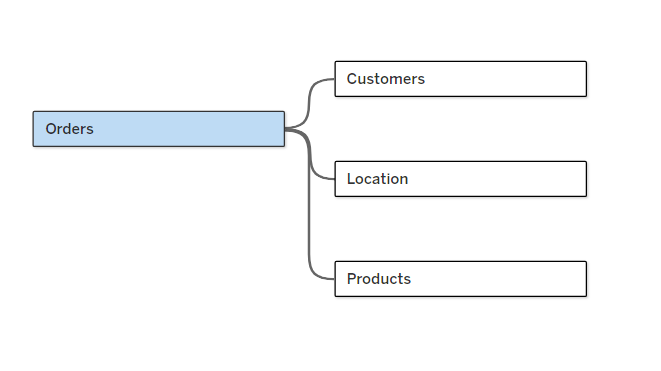

# Tableau-Sales-Customer-Performance-Analysis


---

# 📌 Dashboard Link

### 🔗 Tableau Public Dashboard

https://public.tableau.com/app/profile/aman.jaiswal7145/viz/SalesAnalysis_17819442617410/CustomerDashboard?publish=yes

---

# 📖 Project Overview

Modern businesses generate thousands of sales transactions every year, making it difficult for decision-makers to monitor performance and identify opportunities using raw spreadsheets alone.

This project presents a **fully interactive Tableau Sales & Customer Performance Dashboard** designed to transform raw transactional data into meaningful business insights.

The dashboard enables business users to monitor **Year-over-Year (YoY) sales performance**, analyze customer purchasing behavior, evaluate product profitability, identify top-performing customers, and understand weekly sales trends through a clean and interactive reporting experience.

Built using **Tableau**, this project demonstrates how data visualization can support strategic decision-making through intuitive dashboards, interactive analytics, and dynamic filtering.

---

# 🎯 Business Problem

Business stakeholders often struggle to answer critical questions such as:

- Is our sales performance improving compared to last year?
- Which product categories generate the highest revenue and profit?
- Which products are generating losses despite high sales?
- Which weeks perform above or below average?
- Who are our most valuable customers?
- How many repeat customers do we have?
- How many orders does an average customer place?
- Which regions contribute the most to revenue?

Instead of manually analyzing thousands of rows of transactional data, stakeholders require an interactive dashboard that provides these insights instantly.

---

# 📝 User Story

The objective of this project was to design two professional dashboards that allow business stakeholders to analyze both **Sales Performance** and **Customer Behavior** through interactive visualizations.

The solution focuses on:

- Executive KPI reporting
- Year-over-Year comparison
- Customer analytics
- Product performance analysis
- Weekly sales monitoring
- Interactive business exploration
- Dynamic filtering
- Executive reporting

---

# 🚀 Project Highlights

### 📈 Sales Dashboard

✔ Executive KPI Overview

✔ Year-over-Year Sales Comparison

✔ Monthly Sales Trends

✔ Monthly Profit Trends

✔ Monthly Quantity Trends

✔ Highest & Lowest Performing Months

✔ Product Sub-category Analysis

✔ Weekly Sales & Profit Trend Analysis

✔ Above & Below Average Weekly Performance

---

### 👥 Customer Dashboard

✔ Total Customers

✔ Sales per Customer

✔ Total Orders

✔ Customer Distribution by Number of Orders

✔ Top 10 Customers by Profit

✔ Customer Purchase Behavior

✔ Last Purchase Date Analysis

✔ Customer Ranking

---

# ✨ Dashboard Features

This project demonstrates several advanced Tableau capabilities including:

- ✅ Dynamic Year Selection using Parameters
- ✅ 28 Calculated Fields
- ✅ LOD (Level of Detail) Expressions
- ✅ Interactive Dashboard Navigation
- ✅ Floating Filter Panel
- ✅ Dynamic KPI Cards
- ✅ Customized Tooltips
- ✅ Year-over-Year Comparison
- ✅ Cross Dashboard Navigation
- ✅ Interactive Chart Filtering
- ✅ Professional Dashboard Design
- ✅ Executive-Level Business Reporting

---

# 📊 Dataset Overview

| Attribute | Details |
|-----------|---------|
| Dataset Source | Data with Baraa |
| Visualization Tool | Tableau |
| Dataset Type | Retail Sales Dataset |
| Total Records | **40,000+** |
| Data Model | Relationship Model |
| Fact Table | Orders |
| Dimension Tables | Customers, Products, Location |
| Number of Dashboards | **2** |
| Calculated Fields | **28** |
| Parameters | **1** |
| LOD Expressions | Yes |
| Interactive Navigation | Yes |
| Customized Tooltips | Yes |

---

# 🗂 Data Model

The project follows a **Fact-Dimension Relationship Model**, where the **Orders** table acts as the central fact table connected with three dimension tables.

```
              Customers
                   │
                   │
Products ───── Orders ───── Location
```

### Data Relationships

- **Orders** → Fact Table
- **Customers** → Customer Information
- **Products** → Product Details
- **Location** → Geographic Information

This relationship model enables efficient querying, better scalability, and simplified dashboard development while avoiding unnecessary duplication of data.

> **📷 Data Model Image**

```

```

# 📈 Business KPIs

The dashboards provide executives with a quick overview of the most important business metrics.

### Sales Dashboard

- 💰 Total Sales
- 💵 Total Profit
- 📦 Total Quantity Sold

### Customer Dashboard

- 👥 Total Customers
- 💳 Sales per Customer
- 🛒 Total Orders

Each KPI includes:

- Current Year Performance
- Previous Year Comparison
- Percentage Growth
- Monthly Trend
- Highest Month Indicator
- Lowest Month Indicator

---

# 🎯 Project Objectives

The primary objectives of this dashboard are to:

- Monitor Year-over-Year business performance.
- Analyze sales, profit, and quantity trends.
- Identify profitable and loss-making product categories.
- Understand customer purchasing behavior.
- Measure customer engagement and loyalty.
- Track top-performing customers.
- Enable business users to explore data interactively.
- Provide executives with actionable insights for strategic decision-making.

---

# 📊 Sales Dashboard

The **Sales Dashboard** provides executives and sales managers with a comprehensive overview of business performance, enabling quick identification of revenue trends, profitable product categories, and weekly sales performance.

It compares the **Current Year** with the **Previous Year**, allowing stakeholders to evaluate growth and make informed business decisions.

---

## 🔹 Dashboard Preview

> **📷 Sales Dashboard**


---

## 📌 Key Performance Indicators (KPIs)

The dashboard highlights three executive KPIs that automatically update based on the selected year and applied filters.

| KPI | Description |
|------|-------------|
| 💰 Total Sales | Total sales generated during the selected year |
| 💵 Total Profit | Total profit earned from all completed orders |
| 📦 Total Quantity | Total units sold across all products |

Each KPI includes:

- Current Year Value
- Previous Year Comparison
- Year-over-Year Growth %
- Monthly Trend Line
- Highest Performing Month
- Lowest Performing Month

---

## 📈 Monthly Performance Analysis

Small trend charts are integrated inside each KPI card to visualize monthly performance.

### Features

- Compare Current Year vs Previous Year
- Identify seasonal sales trends
- Highlight highest performing month
- Highlight lowest performing month
- Display Year-over-Year growth percentage

This enables stakeholders to immediately understand whether business performance is improving or declining.

---

## 📦 Product Sub-Category Performance

The Sales Dashboard compares product performance across every product sub-category.

### Business Questions Answered

- Which product generates the highest sales?
- Which products are making losses?
- Which categories are highly profitable?
- Which products require business attention?

The visualization includes:

- Current Year Sales
- Previous Year Sales
- Profit Distribution
- Loss Indicators

This helps managers quickly identify profitable and underperforming product categories.

---

## 📅 Weekly Sales & Profit Analysis

Weekly business performance is visualized using two synchronized charts.

### Metrics Included

- Weekly Sales
- Weekly Profit
- Average Weekly Sales
- Average Weekly Profit

Weeks are automatically classified as:

🟢 Above Average

🔴 Below Average

This allows executives to detect abnormal business activity and identify weeks requiring further investigation.

---

## 💡 Sales Dashboard Insights

Using this dashboard, stakeholders can:

- Monitor overall business growth.
- Compare current performance against previous years.
- Detect seasonal demand fluctuations.
- Identify profitable product categories.
- Discover loss-making products.
- Track weekly performance consistency.
- Support pricing and inventory decisions.

---

# 👥 Customer Dashboard

The **Customer Dashboard** focuses on customer behavior, purchasing habits, and customer profitability.

Instead of only showing sales metrics, this dashboard helps businesses understand **who their customers are**, **how frequently they purchase**, and **which customers contribute the most profit**.

---

## 🔹 Dashboard Preview

> **📷 Customer Dashboard**


---

## 📌 Customer KPIs

Three business KPIs summarize customer performance.

| KPI | Description |
|------|-------------|
| 👥 Total Customers | Number of unique customers |
| 💳 Sales per Customer | Average sales generated by each customer |
| 🛒 Total Orders | Total customer orders |

Each KPI dynamically displays:

- Current Year Value
- Previous Year Comparison
- Monthly Trend
- Highest Month
- Lowest Month
- YoY Growth %

---

## 📈 Customer Trend Analysis

Customer KPIs include miniature trend charts showing monthly movement throughout the year.

These visualizations allow stakeholders to identify:

- Customer acquisition trends
- Customer purchasing patterns
- Seasonal customer activity
- Overall customer growth

---

## 📊 Customer Distribution by Number of Orders

This visualization analyzes customer purchasing frequency.

Instead of listing every customer individually, customers are grouped according to the total number of orders they placed.

Example:

| Orders Placed | Number of Customers |
|---------------|--------------------|
| 1 Order | 200 |
| 2 Orders | 200 |
| 3 Orders | 156 |
| 4 Orders | 85 |
| 5 Orders | 39 |

This provides valuable insights into customer loyalty and repeat purchasing behavior.

Business users can quickly identify whether the business depends on:

- One-time buyers
- Returning customers
- Highly loyal customers

---

## 🏆 Top 10 Customers by Profit

The dashboard ranks the most profitable customers.

Additional information displayed includes:

- Customer Rank
- Customer Name
- Last Order Date
- Current Year Sales
- Current Year Profit
- Number of Orders

This enables management teams to:

- Identify VIP customers.
- Build targeted retention strategies.
- Improve customer relationship management.
- Recognize high-value accounts.

---

## 💡 Customer Dashboard Insights

The dashboard helps answer several important business questions.

Examples include:

- Who are the company's most profitable customers?
- Are customers becoming more active each year?
- How many repeat customers do we have?
- Which customers generate the highest revenue?
- Which customers place the most orders?
- What is the average spending per customer?
- Which customers should receive loyalty rewards?

---

# 🔄 Dashboard Navigation

To improve user experience, the project includes seamless navigation between dashboards.

Users can switch between:

- 📊 Sales Dashboard
- 👥 Customer Dashboard

using navigation buttons placed in the dashboard header.

This eliminates the need to manually search for worksheets and provides an application-like experience.

---

# 🎛 Interactive Filter Panel

Instead of permanently displaying slicers, a **collapsible filter panel** was designed to maximize dashboard space while maintaining full interactivity.

### 🔹 Filter Panel Preview


The panel can be opened or hidden using a dedicated filter button.

Available filters include:

### Time Filters

- Year

### Product Filters

- Category
- Sub-Category

### Geographic Filters

- Region
- State
- City

This design keeps the dashboard clean while allowing users to perform detailed analysis whenever required.

---

# 🎨 Customized Tooltips

One of the major highlights of this project is the use of **customized tooltips**.

Instead of displaying Tableau's default tooltip, every KPI trend chart provides rich contextual information including:

- Selected Month
- Current Year Value
- Previous Year Value
- Percentage Difference
- Growth Indicator

These tooltips improve dashboard usability by allowing users to access detailed information without leaving the current visualization.

---

# ⚡ Interactive Features

The dashboard includes several advanced interactive capabilities:

- ✅ Dynamic Year Parameter
- ✅ Interactive Filtering
- ✅ Dashboard Navigation Buttons
- ✅ Collapsible Filter Panel
- ✅ Customized Tooltips
- ✅ Dynamic KPI Cards
- ✅ Cross-Filtering Between Visuals
- ✅ Automatic Highest & Lowest Month Highlighting
- ✅ Responsive Dashboard Layout

These features provide an intuitive user experience and enable stakeholders to perform self-service analytics without technical expertise.

# 🛠 Technical Implementation

The dashboard was developed using modern Tableau development practices with a strong emphasis on scalability, performance, interactivity, and business storytelling.

The project involved connecting multiple related datasets, creating reusable calculated fields, implementing dynamic parameters, designing interactive dashboards, and building customized tooltips to enhance user experience.

---

# 🗃 Data Modeling

A relationship-based data model was created to connect the transactional data with supporting dimension tables.

### Tables Used

| Table | Purpose |
|---------|---------|
| Orders | Sales Transactions (Fact Table) |
| Customers | Customer Information |
| Products | Product Details |
| Location | Geographic Information |

The **Orders** table acts as the central fact table while the remaining tables provide descriptive information for customers, products, and locations.

This relationship model helps:

- Reduce data duplication
- Improve dashboard performance
- Simplify dashboard development
- Maintain data integrity

---

# 🧮 Calculated Fields

A total of **28 calculated fields** were created throughout the project.

These calculations were used for:

- KPI Calculations
- Previous Year Metrics
- Current Year Metrics
- Dynamic Titles
- Percentage Growth
- Difference Calculations
- Customer Analysis
- Weekly Average Calculations
- Dynamic Labels
- Tooltip Calculations

Some of the important calculations include:

- Current Year Sales
- Previous Year Sales
- Current Year Profit
- Previous Year Profit
- Current Year Quantity
- Previous Year Quantity
- Current Year Customers
- Previous Year Customers
- Sales Difference %
- Profit Difference %
- Quantity Difference %
- Customer Difference %

These calculations allow the dashboard to update dynamically based on the selected year.

---

# 📅 Dynamic Year Selection

The dashboard uses a **Year Parameter** that allows users to select any available year in the dataset.

Instead of creating separate dashboards for each year, the selected year automatically updates:

- KPI Cards
- Monthly Trends
- Weekly Analysis
- Product Performance
- Customer Analysis
- Tooltips

This makes the dashboard reusable and scalable for future data updates.

---

# 📐 Level of Detail (LOD) Expressions

LOD Expressions were implemented to perform calculations independent of the visualization level.

They were primarily used for:

- Customer-Level Calculations
- Order Frequency Analysis
- KPI Calculations
- Customer Distribution
- Profit Analysis

Using LOD expressions ensured accurate calculations while maintaining dashboard flexibility.

---

# 🎯 Customized Tooltips

Instead of relying on Tableau's default tooltip, customized tooltip worksheets were created to provide a richer analytical experience.

Each tooltip dynamically displays:

- Selected Month
- Current Year Value
- Previous Year Value
- Difference
- Percentage Growth

This allows users to obtain additional insights simply by hovering over a chart without leaving the dashboard.

---

## Tooltip Preview


---

# 📌 Parameter-Driven Reporting

A parameter was used to build a fully dynamic reporting experience.

### Parameter Used

| Parameter | Purpose |
|------------|---------|
| Select Year | Allows users to compare any year against its previous year |

Benefits:

- Single dashboard for multiple years
- Reduced maintenance
- Improved scalability
- Better user experience

---

# 🎛 Interactive Dashboard Features

The dashboard provides an application-like experience through multiple interactive components.

## Interactive Features

✔ Dynamic Year Selection

✔ Interactive Filters

✔ Floating Filter Panel

✔ Dashboard Navigation Buttons

✔ Customized Tooltips

✔ Dynamic KPI Cards

✔ Cross Filtering

✔ Highlighting

✔ Automatic Dashboard Updates

---

# 🎨 Dashboard Design Principles

Several dashboard design best practices were followed while developing this project.

### Design Goals

- Clean Layout
- Consistent Color Palette
- Proper Visual Hierarchy
- Minimal Cognitive Load
- High Readability
- Interactive User Experience

Every visualization was carefully positioned to maximize readability while reducing unnecessary dashboard clutter.

---

# 📊 Dashboard Components

The project consists of more than **20 interactive visualizations**, including:

### KPI Cards

- Total Sales
- Total Profit
- Total Quantity
- Total Customers
- Sales per Customer
- Total Orders

### Charts

- Monthly Sales Trends
- Monthly Profit Trends
- Monthly Quantity Trends
- Product Subcategory Comparison
- Weekly Sales Trend
- Weekly Profit Trend
- Customer Distribution
- Top 10 Customers
- Sales vs Profit Comparison

### Interactive Components

- Dynamic Tooltips
- Floating Filter Panel
- Navigation Buttons
- Dashboard Filters
- Parameter Controls

---

# 📈 Business Value

This dashboard enables stakeholders to answer important business questions in just a few clicks.

Examples include:

- Is sales performance improving year-over-year?
- Which product categories generate the highest profit?
- Which products are underperforming?
- Which customers generate the highest profit?
- How many repeat customers do we have?
- Which weeks performed above or below average?
- How does customer behavior change over time?

Instead of manually analyzing thousands of rows, decision-makers can interactively explore the data and uncover actionable insights.

---

# 🎓 Skills Demonstrated

This project demonstrates practical experience across multiple areas of Business Intelligence and Data Analytics.

### Tableau

- Dashboard Development
- Interactive Visualizations
- Dashboard Actions
- Parameters
- LOD Expressions
- Calculated Fields
- Dashboard Navigation
- Floating Containers
- Customized Tooltips
- Filters
- Formatting
- Storytelling

### Data Analytics

- KPI Development
- Business Analysis
- Trend Analysis
- Customer Segmentation
- Sales Analysis
- Performance Reporting

### Business Intelligence

- Executive Dashboard Design
- Year-over-Year Analysis
- Customer Analytics
- Product Analytics
- Weekly Performance Monitoring
- Business Storytelling

---

# 🚀 Project Statistics

| Metric | Value |
|---------|-------|
| Dataset Records | **40,000+** |
| Dashboards | **2** |
| Data Tables | **4** |
| Calculated Fields | **28** |
| Parameter | **1** |
| LOD Expressions | ✅ |
| Dashboard Navigation | ✅ |
| Customized Tooltips | ✅ |
| Interactive Filters | ✅ |
| KPI Cards | **6** |
| Interactive Charts | **20+** |

---

# 📚 Key Learnings

Through this project, I strengthened my understanding of:

- Tableau Dashboard Development
- Data Modeling using Relationships
- Advanced Calculated Fields
- Level of Detail (LOD) Expressions
- Parameter-Driven Dashboards
- Interactive Dashboard Design
- Customized Tooltips
- Dashboard Navigation
- Executive Reporting
- Business Storytelling with Data

This project significantly enhanced both my technical Tableau skills and my ability to communicate business insights through interactive visualizations.

---

# 💡 Key Business Insights

The dashboards reveal several meaningful insights that can support strategic business decisions.

## 📈 Sales Performance

- Year-over-Year comparison enables quick evaluation of business growth.
- Monthly trend analysis highlights seasonal sales patterns.
- Highest and lowest performing months are clearly identified.
- Weekly analysis helps detect unusually strong or weak business performance.

---

## 📦 Product Analysis

- Product sub-category comparison identifies top-performing products.
- Simultaneous Sales and Profit comparison highlights products generating high revenue but low profitability.
- Supports inventory optimization and pricing strategy decisions.

---

## 👥 Customer Insights

- Customer growth trends provide visibility into acquisition and retention.
- Customer distribution analysis reveals purchasing frequency and loyalty.
- Top 10 customer analysis identifies high-value customers for retention strategies.
- Sales per customer KPI measures overall customer value.

---

## 📊 Executive Decision Support

The dashboards empower stakeholders to:

- Monitor company performance.
- Compare annual growth.
- Analyze customer behavior.
- Evaluate product profitability.
- Track weekly performance.
- Identify improvement opportunities.
- Support data-driven decision-making.

---

# 🧠 Challenges Faced

During the development of this project, several technical challenges were encountered and successfully resolved.

### Challenge 1

Creating dynamic Year-over-Year calculations.

**Solution**

Implemented parameter-driven calculated fields for current and previous year metrics.

---

### Challenge 2

Designing customized tooltips.

**Solution**

Built dedicated tooltip worksheets using calculated fields and dynamic labels.

---

### Challenge 3

Maintaining dashboard cleanliness while providing multiple filters.

**Solution**

Designed a collapsible floating filter panel with dashboard actions.

---

### Challenge 4

Building reusable calculations.

**Solution**

Created 28 reusable calculated fields and LOD expressions to simplify dashboard maintenance.

---

# 📚 Repository Structure

```text
Huai-Sales-Customer-Performance-Dashboard-Tabelau
│
├── Dataset
│   ├── Orders.csv
│   ├── Customers.csv
│   ├── Products.csv
│   └── Location.csv
│
├── Tableau Workbook
│   └── Sales Analysis.twbx
│
├── Images
│   ├── Sales Dashboard.png
│   ├── Customer Dashboard.png
│   ├── Customized Tooltip.png
│   ├── Floating Filter.png
│   └── Data Model.png
|
│-- Business-Requirements.txt
|
└── README.md
```

---

# 🚀 Future Improvements

Although the dashboard is fully interactive, several enhancements could further improve its capabilities.

Potential future enhancements include:

- Forecasting future sales trends.
- Customer segmentation using RFM analysis.
- Profit forecasting.
- Regional sales forecasting.
- Drill-through dashboards.
- Mobile dashboard optimization.
- Tableau Public Story integration.
- Automated data refresh.

---

# 🎯 Why This Project?

This project demonstrates much more than dashboard creation.

It showcases the complete analytical workflow:

- Understanding business requirements.
- Designing a scalable data model.
- Creating reusable calculations.
- Implementing advanced Tableau features.
- Building interactive dashboards.
- Transforming raw data into actionable business insights.

The goal was not simply to visualize data, but to create a reporting solution that business stakeholders can use to make informed decisions.

---

# 🛠 Skills Demonstrated

## Business Intelligence

- Executive Dashboard Development
- KPI Reporting
- Interactive Analytics
- Business Storytelling

### Tableau

- Dashboard Design
- Parameters
- LOD Expressions
- Calculated Fields
- Dashboard Actions
- Navigation Buttons
- Floating Containers
- Dynamic Tooltips
- Interactive Filters

### Analytics

- Sales Analysis
- Customer Analysis
- Product Performance
- Trend Analysis
- Comparative Analysis
- Customer Segmentation
- Weekly Performance Analysis

### Soft Skills

- Problem Solving
- Analytical Thinking
- Data Storytelling
- Dashboard Design
- Business Understanding

---

# 👨‍💻 About Me

Hi, I'm **Aman Jaglal Jaiswal**, an aspiring **Data Analyst** passionate about transforming raw data into meaningful business insights.

I enjoy working with **SQL**, **Python**, **Excel**, **Power BI**, and **Tableau**, and I continuously build projects that strengthen my analytical thinking and technical skills.

This repository is one of several hands-on projects in my data analytics portfolio, reflecting my commitment to learning through real-world business scenarios.

---

# 📬 Connect With Me

📧 **Email:** amanjaswal1004@gmail.com

💼 **LinkedIn:** https://linkedin.com/in/aman-jaiswal-27048b335

💻 **GitHub:** https://github.com/Aman-Jaiswal32

---

# ⭐ If You Like This Project...

If you found this project helpful or interesting:

⭐ Star this repository

🍴 Fork the repository

📢 Share your feedback

Every suggestion helps me improve and build better analytics solutions.

---

# 🙏 Thank You

Thank you for taking the time to explore this project.

I hope this dashboard demonstrates not only my Tableau skills but also my ability to solve business problems through data visualization, analytical thinking, and interactive reporting.

If you have any suggestions or feedback, I'd be happy to hear them.

**Happy Exploring! 📊**
